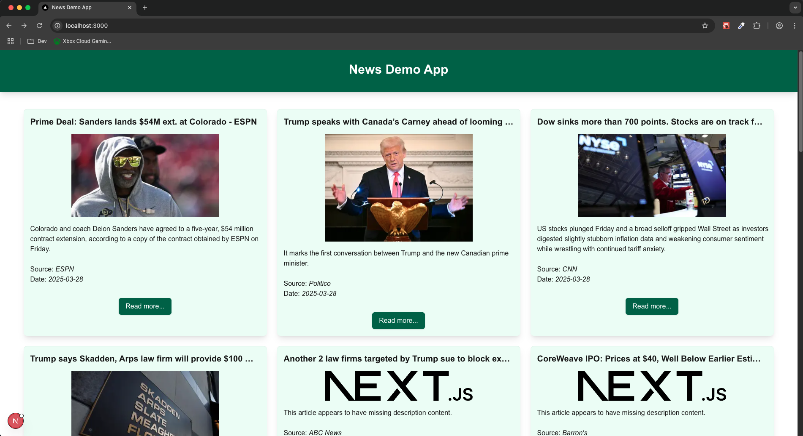
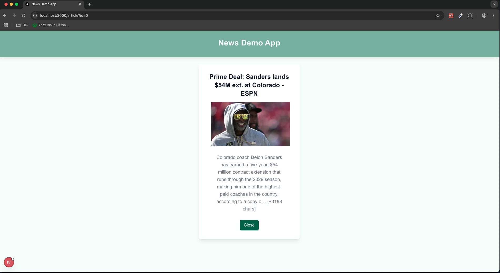
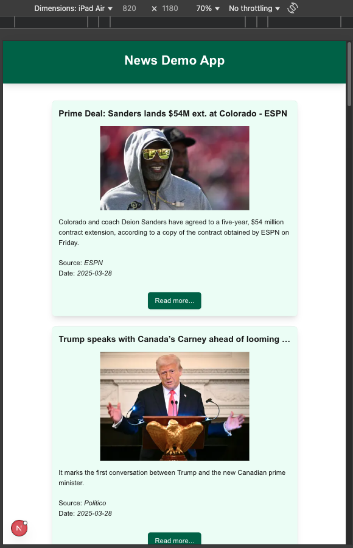
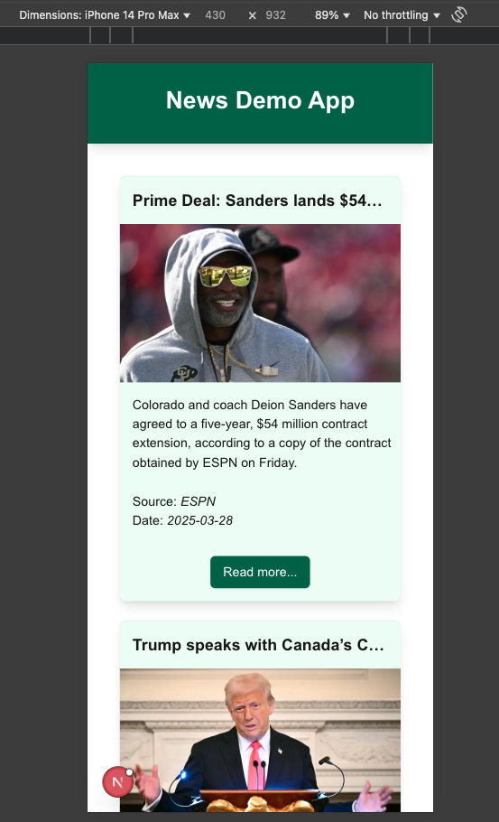

# News Demo App | AA x RC

### Rendering kind explanation
I used **SSR** in 90% of the pages/components of this demo app considering to have a best perfomance and shorter loading times, since all the work is made by the server, that has always better connectivity compared with the users.
Only in one component (modal window) I used **CSR**, this because is recommended when we need to manage user interaction in the UI.

### What I did to improve performance?
- Use of Next.js Image component that by default provides images lazy-loading.
- Use of App Router features such as Link components, preventing the complete UI reload when the url PATH changes.

### Libraries explanation
- React.js: as expected, to make reusable components and use its basic hooks to an easily functionality.
- Fetch API: since is the native JavaScript API library for asyncronous data fetching, and nsize of the project doesn't requires a most powerfull library.
- Tailwind CSS: taking advantage of already defined classes to write less code and having a very good load performance.

### Screenshots
Desktop:
________



Tablet:
________



Mobile:
________



### Vercel deplyed app URL
...

****

## General info

This is a [Next.js](https://nextjs.org) project bootstrapped with [`create-next-app`](https://github.com/vercel/next.js/tree/canary/packages/create-next-app).

## Getting Started

First, run the development server:

```bash
npm run dev
# or
yarn dev
# or
pnpm dev
# or
bun dev
```

Open [http://localhost:3000](http://localhost:3000) with your browser to see the result.

You can start editing the page by modifying `app/page.js`. The page auto-updates as you edit the file.

This project uses [`next/font`](https://nextjs.org/docs/app/building-your-application/optimizing/fonts) to automatically optimize and load [Geist](https://vercel.com/font), a new font family for Vercel.

## Learn More

To learn more about Next.js, take a look at the following resources:

- [Next.js Documentation](https://nextjs.org/docs) - learn about Next.js features and API.
- [Learn Next.js](https://nextjs.org/learn) - an interactive Next.js tutorial.

You can check out [the Next.js GitHub repository](https://github.com/vercel/next.js) - your feedback and contributions are welcome!

## Deploy on Vercel

The easiest way to deploy your Next.js app is to use the [Vercel Platform](https://vercel.com/new?utm_medium=default-template&filter=next.js&utm_source=create-next-app&utm_campaign=create-next-app-readme) from the creators of Next.js.

Check out our [Next.js deployment documentation](https://nextjs.org/docs/app/building-your-application/deploying) for more details.
